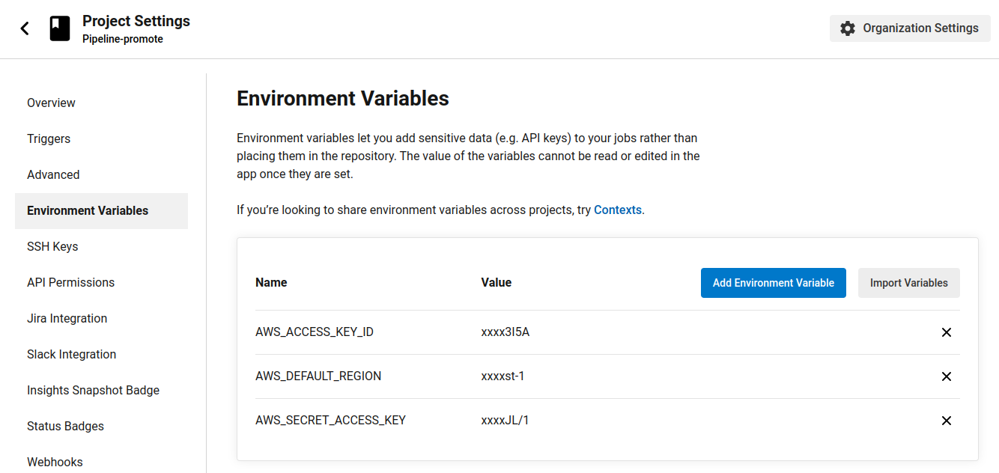

# Promote To Production!

It is a hands-on experience implementing `CircleCi pipeline` that automates switching from the blue (old) version to the green (new) version of the app aka `Blue-Green deployment!`

## Tools Used

1. `AWS s3 bucket` to host a static website
2. `AWS CloudFront distribution` with s3 bucket origin path to make our simple `HTML` get hit via `CDN` (content delivery network)
3. `AWS Cloudformation` so that we can provision the s3 and the CloudFront distribution
4. CircleCi pipeline that is triggered when a new version of code is pushed to the master branch. Steps Are:

   - Get the blue (old) version s3 that we want to delete after promoting the new version
   - provision a s3 bucket via cloud formation
   - Upload the new code on the s3
   - Route the traffic to the green (new version)
   - Delete the (blue) old version

## Quick Start

1. Fork My Code
2. Make a new [CircleCi Project](https://circleci.com/)
3. Link The newly forked repo with CircleCi
4. Make sure to put securely your AWS account credintionals as Environment variables as shown:



5. Make sure to install the AWS CLI tool
6. Make a new S3 bucket and enable the website hosting option
   - upload basic `HTML` contains `Hello from version one`
7. Assign the write bucket policy:

```
   {
    "Version": "2008-10-17",
    "Statement": [
        {
            "Sid": "PublicReadForGetBucketObjects",
            "Effect": "Allow",
            "Principal": "*",
            "Action": "s3:GetObject",
            "Resource": "arn:aws:s3:::[You-Bucket-Name]/*"
        }
    ]
   }
```

7. manually Make CloudFront that has your s3 bucket as origin using this command in your project directory:

```
aws cloudformation deploy \
            --template-file cloudfront.yml \
            --stack-name production-distro \
            --parameter-overrides PipelineID="[Your-Newly-Created-Bucket-Name]"
```

8. Trigger the CircleCi pipeline by pushing any changes to the master branch
